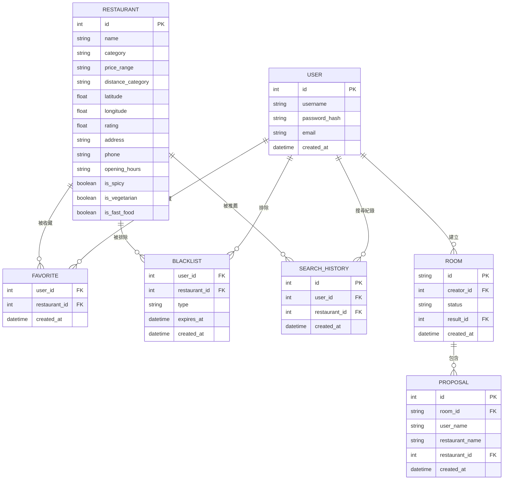

# 資料庫設計文件：隨便吃什麼都好系統 (Whatever Eatery)

根據 PRD 與 FLOWCHART 的需求，本系統設計了以下 SQLite 資料表結構，以支援隨機推薦、篩選、黑名單、收藏與多人輪盤房間功能。

## 1. ER 圖（實體關係圖）

## 2. 資料表詳細說明

### 2.1 USER (使用者)
用於儲存使用者帳號資訊。
- `id`: INTEGER PRIMARY KEY AUTOINCREMENT
- `username`: TEXT, 必填, 唯一
- `password_hash`: TEXT, 必填
- `email`: TEXT, 唯一
- `created_at`: DATETIME, 預設為目前時間

### 2.2 RESTAURANT (餐廳)
儲存可供推薦的餐廳基本資訊。
- `id`: INTEGER PRIMARY KEY AUTOINCREMENT
- `name`: TEXT, 必填
- `category`: TEXT (如：義式、日式)
- `price_range`: TEXT ($, $$, $$$)
- `distance_category`: TEXT (步行 5 分鐘, 步行 10 分鐘, 需搭車)
- `latitude`: REAL
- `longitude`: REAL
- `rating`: REAL
- `address`: TEXT
- `phone`: TEXT
- `opening_hours`: TEXT
- `is_spicy`: BOOLEAN
- `is_vegetarian`: BOOLEAN
- `is_fast_food`: BOOLEAN

### 2.3 FAVORITE (我的最愛)
紀錄使用者收藏的餐廳（多對多關係）。
- `user_id`: INTEGER, FOREIGN KEY REFERENCES USER(id)
- `restaurant_id`: INTEGER, FOREIGN KEY REFERENCES RESTAURANT(id)
- `created_at`: DATETIME

### 2.4 BLACKLIST (排除名單)
紀錄使用者不滿意或想暫時排除的餐廳。
- `user_id`: INTEGER, FOREIGN KEY REFERENCES USER(id)
- `restaurant_id`: INTEGER, FOREIGN KEY REFERENCES RESTAURANT(id)
- `type`: TEXT (temporary/permanent)
- `expires_at`: DATETIME, 暫時排除的到期時間
- `created_at`: DATETIME

### 2.5 SEARCH_HISTORY (歷史紀錄)
紀錄使用者過去曾獲得的推薦結果。
- `id`: INTEGER PRIMARY KEY AUTOINCREMENT
- `user_id`: INTEGER, FOREIGN KEY REFERENCES USER(id)
- `restaurant_id`: INTEGER, FOREIGN KEY REFERENCES RESTAURANT(id)
- `created_at`: DATETIME

### 2.6 ROOM (決策房間)
多人決策輪盤的房間資訊。
- `id`: TEXT PRIMARY KEY (UUID 或隨機字串)
- `creator_id`: INTEGER, FOREIGN KEY REFERENCES USER(id) (可為 NULL)
- `status`: TEXT (open/closed)
- `result_id`: INTEGER, FOREIGN KEY REFERENCES RESTAURANT(id) (可為 NULL)
- `created_at`: DATETIME

### 2.7 PROPOSAL (房間提議)
參與者在房間內提交的餐廳選項。
- `id`: INTEGER PRIMARY KEY AUTOINCREMENT
- `room_id`: TEXT, FOREIGN KEY REFERENCES ROOM(id)
- `user_name`: TEXT, 提議者名稱
- `restaurant_name`: TEXT, 餐廳名稱（手動輸入）
- `restaurant_id`: INTEGER, FOREIGN KEY REFERENCES RESTAURANT(id) (可為 NULL)
- `created_at`: DATETIME

## 3. SQL 建表語法

請參閱 `database/schema.sql`。

## 4. Python Model 程式碼

請參閱 `app/models/` 資料夾下的對應檔案。
