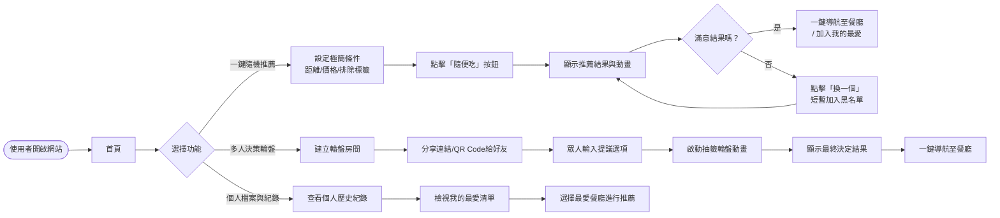
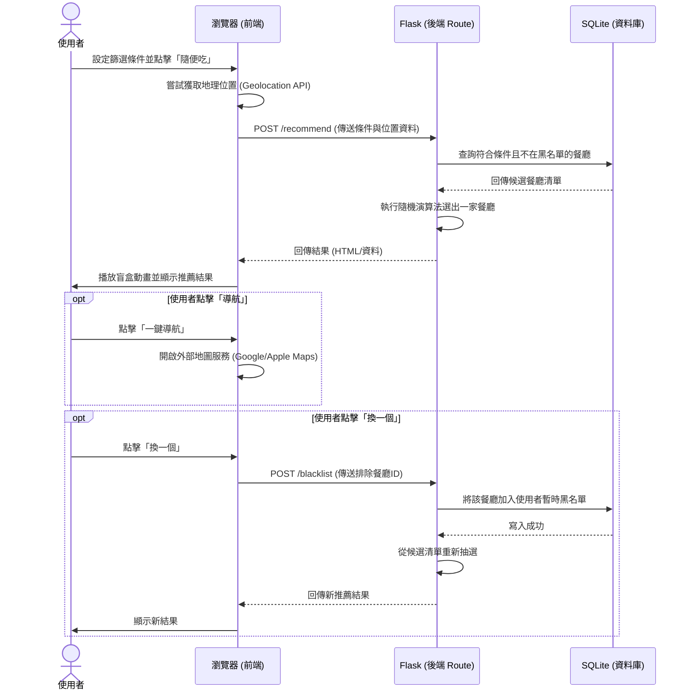

# 系統流程圖文件：隨便吃什麼都好系統 (Whatever Eatery)

根據產品需求文件 (PRD) 與技術架構 (ARCHITECTURE) 所設計的系統流程圖，包含使用者流程圖、系統序列圖與功能清單對照表。

## 1. 使用者流程圖（User Flow）

描述使用者進入系統後，操作各項核心功能（一鍵隨機推薦、多人決策輪盤、歷史紀錄）的路徑。

## 2. 系統序列圖（Sequence Diagram）

描述「使用者點擊隨便吃（一鍵隨機推薦）」到「資料庫查詢並回傳結果」的完整系統資料流。

## 3. 功能清單對照表

系統主要功能與對應的 URL 路徑、HTTP 方法之設計。

| 功能區塊 | 功能說明 | URL 路徑 | HTTP 方法 |
| :--- | :--- | :--- | :--- |
| **首頁** | 系統入口，提供隨機推薦表單與建立房間入口 | `/` | GET |
| **隨機推薦** | 接收條件與位置，回傳隨機抽選的餐廳結果 | `/recommend` | POST |
| **換一個 (黑名單)** | 將不滿意的結果加入短暫黑名單，並重抽餐廳 | `/blacklist` | POST |
| **我的最愛** | 將滿意的餐廳加入個人最愛清單 | `/favorite` | POST |
| **決策輪盤** | 建立一個新的多人決策輪盤房間 | `/room/create` | POST |
| **決策輪盤** | 進入特定的輪盤房間頁面 | `/room/<room_id>` | GET |
| **決策輪盤** | 在房間內提交想吃的選項 | `/room/<room_id>/propose` | POST |
| **決策輪盤** | 啟動房間的輪盤抽選並記錄結果 | `/room/<room_id>/spin` | POST |
| **個人檔案** | 查看個人的歷史推薦紀錄與最愛餐廳 | `/profile` | GET |
